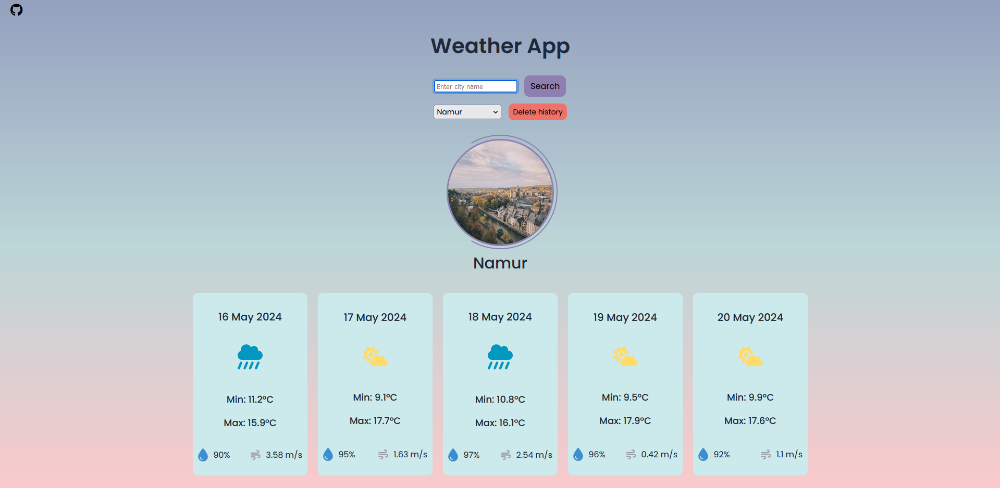

# Weather App

## Overview

This Weather App is a simple web application that allows users to check the current weather conditions of any location worldwide. Users can enter the name of a city or town, and the app will display the current temperature, weather conditions (e.g., sunny, rainy, cloudy), and other relevant information.

## Features

- Current Weather: Get the current weather conditions for any location.
- Search Functionality: Enter the name of a city or town to get the weather information.
- Responsive Design: The app is designed to work seamlessly across various devices, including desktops, tablets, and mobile phones.

## Technologies Used

- Frontend: HTML, CSS, JavaScript
- Weather API: This app utilizes a weather API to fetch current weather data for different locations.
- Unsplash API: The app also uses the Unsplash API to display a photo of the cities when a search is made.

## Usage

1. Open the Weather App in your web browser.
2. In the search bar, enter the name of the city or town for which you want to check the weather.
3. Press Enter or click the search button.
4. The app will display the current weather conditions for the specified location.

## Demo

Click [HERE](https://justine-frigo.github.io/Weather-app/) to see my app !  

## Contributing

Contributions to the Weather App are welcome! If you have any suggestions, bug reports, or feature requests, please submit them via GitHub issues.

## Acknowledgments

This Weather App was created by Justine Frigo.
